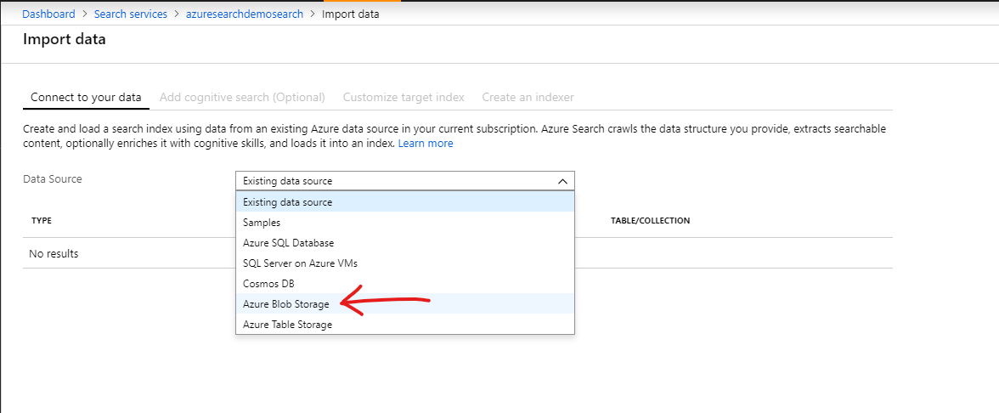
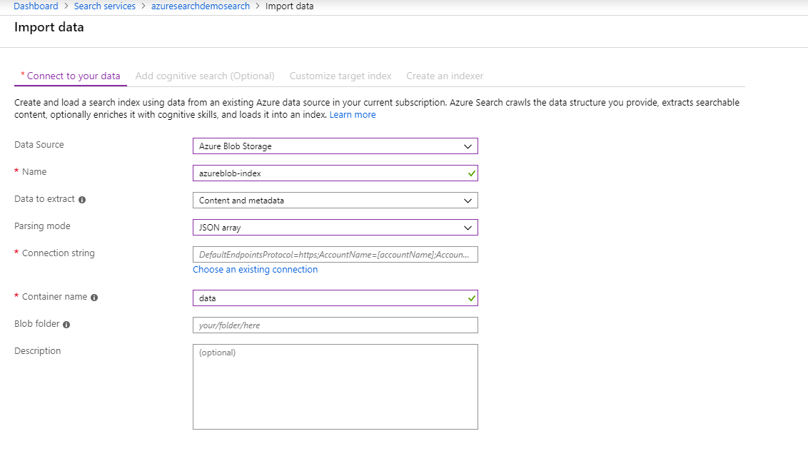
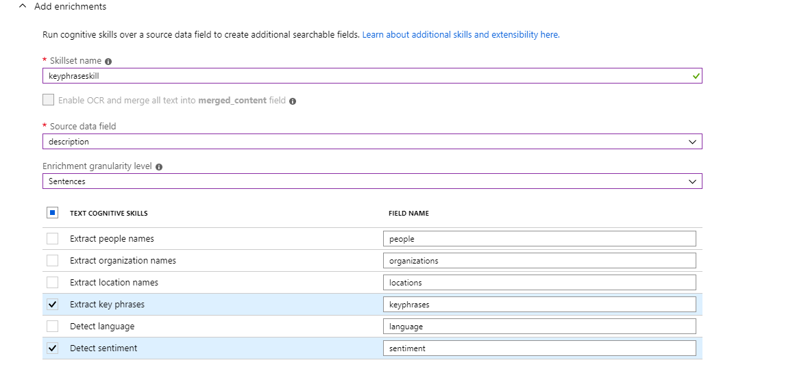
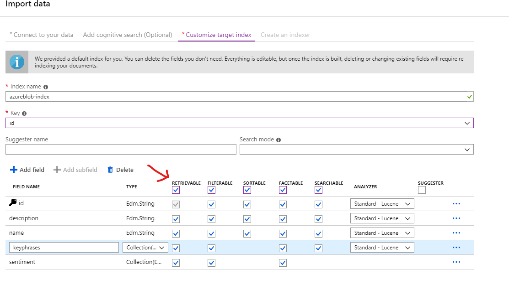
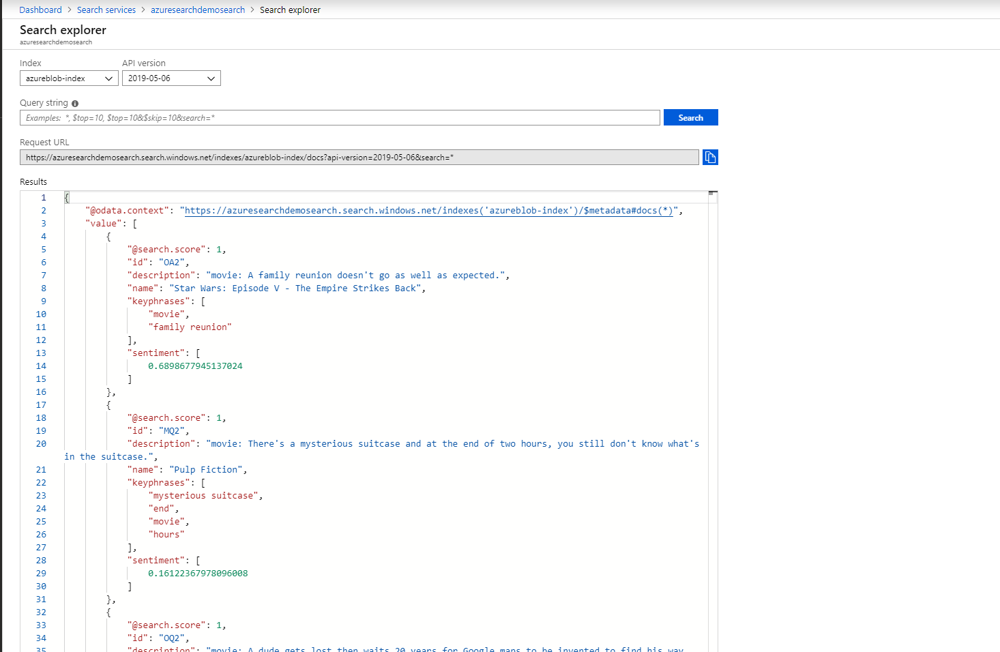
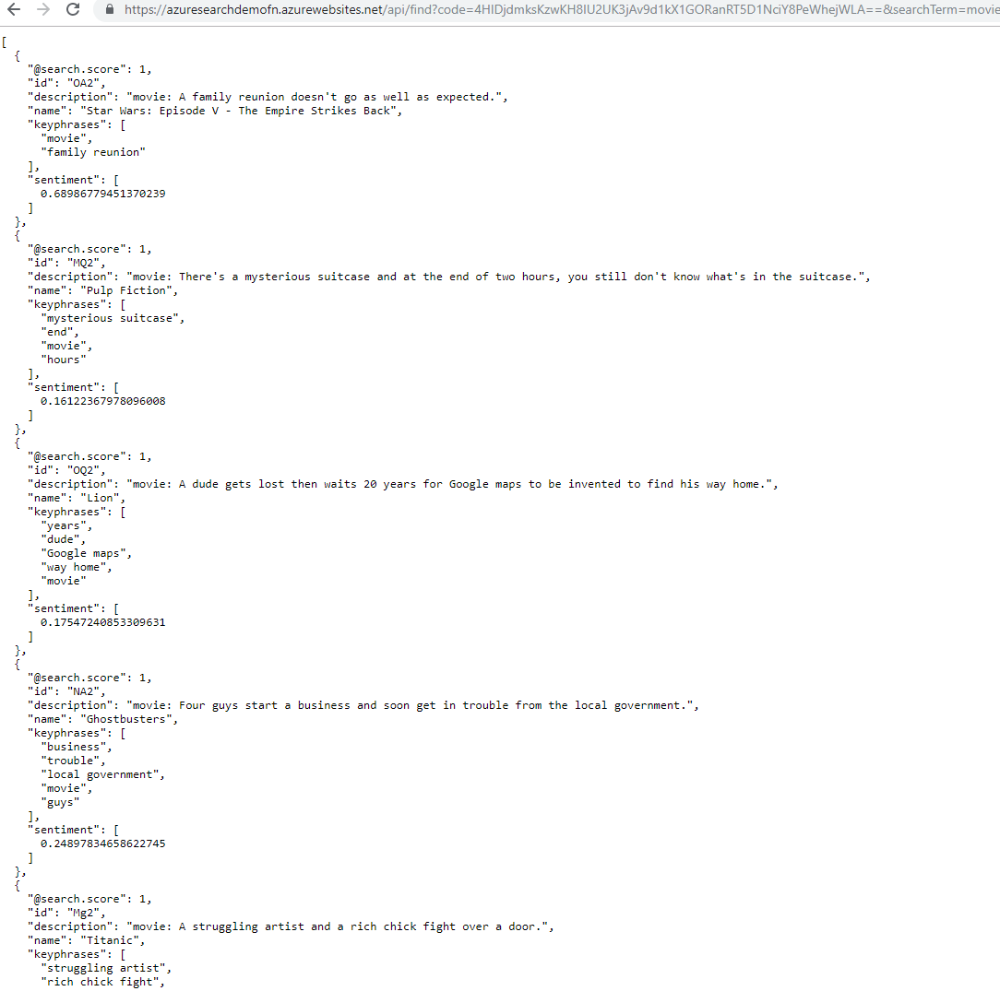

# Creating the Azure Search index based on data in [data.json](./data.json)

* Navigate to your newly created Azure Search Service and click on "import data."

### Connect to your data
* Select Azure Blob Storage for Data Source.

* Enter the following values
  * Name: azureblob-index (note it's important to use this name as the azure function is preconfigured to look for this index.)
  * Data to extract: Content and metadata
  * Parsing Mode: JSON array
  * Connection string (enter connection string terraform output)
  * Container name: data (note it's important to use this name, since this is the container name created by terraform).

  * click "Next: Add cognitive search (optional)"

### Add Cognitive Skill 
* Expand the Attach Cognitive Services section
* Ensure the Free (Limited encrichments) option is selected.

* Expand the Add Encrichments section
* Enter "keyphraseskill" as the skillset name.
* Select "Description" as the Source data field.
* Select "Sentences" for Enrichement granularity level.
* Check the following cognitive skills
  * Extract key phrases,
  * Detect sentiment.

  
* Click Next: Customize target index.

### Customize target index

* Change the key from AzureSearch_DocumentKey to id
* Delete all the metadata_storage fields and AzureSearch_DocumentKey.
  

* At the top row check the boxes for "Rereivable, Fitlerable,Sortable,Facetable & Searchable." This should check those options for all fields.
  

* Click "Next: Create an indexer.

## Create an indexer
* name the indexer "azuresearch-indexer"
* Click "Submit"

## Testing our index
* Navigate to the search service overview page (you should be taken there after creating the indexer.)
* Click the "Search Explorer" button.

  
* Click Search, alll the items form the json file should appear.

  

## Test the Azure Function.
* Grab the url from the terraform output log. If you do not have the url handy you can get it via the following sources:
  * in the cli, invoke "func azure functionapp list-functions azuresearchdemofn --show-key"
  
  or 

  * Navigate to the function app in the Azure Portal
  * Select the "Find function"
  * Click "Get function Url"

* Open a new browser tab and go paste the function url. Add &searchTerm=movie to the end of the url.
* You should see a json object with data from Azure search.

  

* Try changing the searchTerm and search for "movies with dude", you should get one result back.

